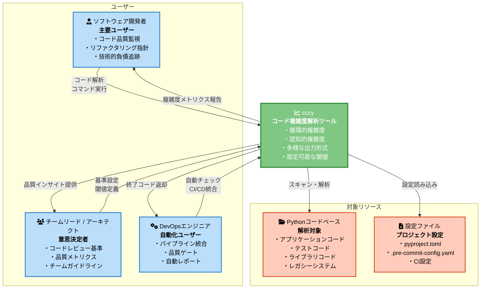

# cccy アーキテクチャ設計書

## 概要

cccyは、Pythonコードの循環的複雑度と認知的複雑度を測定するCLIツールです。本システムはClean Architectureの原則に基づいて設計されており、依存性の方向を制御し、テスタビリティと保守性を向上させています。

## アーキテクチャ図（C4モデル - システムコンテキスト）



### システムコンテキスト図の説明

このシステムコンテキスト図は、cccyシステムの最も高レベルな視点を示しています。

#### 主要なアクター（ユーザー）
- **ソフトウェア開発者**: 日常的なコード品質の監視とリファクタリング時の指標として利用
- **チームリード / アーキテクト**: プロジェクト全体の品質基準の設定と監視
- **DevOpsエンジニア**: CI/CDパイプラインへの統合と自動化された品質チェック

#### システムとの相互作用
- **入力**: ユーザーからのコマンド実行、設定ファイルの読み込み、Pythonコードベースの解析
- **出力**: 複雑度メトリクス、品質レポート、CI/CD用の終了コード

## アーキテクチャ図（C4モデル - コンテナーレベル）

```mermaid
graph TB
    subgraph "cccy System Boundary"
        subgraph "Presentation Layer"
            CLI["fa:fa-terminal CLI Interface<br/><b>Click Framework</b><br/>・Command routing<br/>・Argument parsing<br/>・Option validation<br/>・Error handling"]
            Factory["fa:fa-cogs Service Factory<br/><b>DI Container</b><br/>・Service composition<br/>・Dependency injection<br/>・Instance lifecycle<br/>・Configuration binding"]
        end
        
        subgraph "Application Layer"
            Facade["fa:fa-layer-group CLI Facade Service<br/><b>Use Case Orchestration</b><br/>・check command<br/>・show-list command<br/>・show-summary command<br/>・Result aggregation"]
            AnalysisService["fa:fa-search Analysis Service<br/><b>Path & Filter Management</b><br/>・Path resolution<br/>・Pattern matching<br/>・Exclusion filtering<br/>・Result processing"]
        end
        
        subgraph "Domain Layer"
            Interfaces["fa:fa-plug Domain Interfaces<br/><b>Port Definitions</b><br/>・IComplexityCalculator<br/>・IConfigurationReader<br/>・IOutputFormatter<br/>・Service contracts"]
            Entities["fa:fa-database Domain Entities<br/><b>Value Objects</b><br/>・ComplexityResult<br/>・FileComplexityResult<br/>・FunctionComplexity<br/>・Status enums"]
            DomainServices["fa:fa-brain Domain Services<br/><b>Core Business Logic</b><br/>・ComplexityAnalyzer<br/>・AST traversal<br/>・Result aggregation<br/>・Threshold evaluation"]
        end
        
        subgraph "Infrastructure Layer"
            subgraph "Calculators"
                CycCalculator["fa:fa-calculator Cyclomatic Calculator<br/><b>mccabe Adapter</b><br/>・Control flow analysis<br/>・Branch counting<br/>・Decision points"]
                CogCalculator["fa:fa-calculator Cognitive Calculator<br/><b>cognitive-complexity Adapter</b><br/>・Nesting analysis<br/>・Mental effort scoring<br/>・Human readability"]
            end
            
            subgraph "Configuration"
                ConfigReader["fa:fa-file-alt Config Reader<br/><b>pyproject.toml Parser</b><br/>・TOML parsing<br/>・Schema validation<br/>・Default merging"]
                ConfigMerger["fa:fa-code-merge Config Merger<br/><b>Options Resolver</b><br/>・CLI precedence<br/>・Config fallback<br/>・Path expansion"]
            end
            
            subgraph "Output"
                TableFormatter["fa:fa-table Table Formatter<br/><b>Tabulate Adapter</b><br/>・ASCII tables<br/>・Column alignment<br/>・Color coding"]
                JSONFormatter["fa:fa-file-code JSON Formatter<br/><b>JSON Serializer</b><br/>・Structured output<br/>・Machine readable<br/>・Schema compliance"]
                CSVFormatter["fa:fa-file-csv CSV Formatter<br/><b>CSV Writer</b><br/>・Spreadsheet format<br/>・Header generation<br/>・Escaping rules"]
                SummaryFormatter["fa:fa-chart-bar Summary Formatter<br/><b>Statistics Generator</b><br/>・Aggregations<br/>・Percentiles<br/>・Distribution"]
            end
            
            LogConfig["fa:fa-file-text Logging Config<br/><b>Log Management</b><br/>・Level control<br/>・Format setup<br/>・Handler config<br/>・Verbosity modes"]
        end
    end
    
    subgraph "External Dependencies"
        FS["fa:fa-hdd File System<br/><b>OS Interface</b><br/>・Python source files<br/>・Configuration files<br/>・Directory traversal<br/>・Path operations"]
        Terminal["fa:fa-desktop Console Terminal<br/><b>User Interface</b><br/>・Command input<br/>・Progress display<br/>・Result output<br/>・Error messages"]
        PyPI["fa:fa-cube External Libraries<br/><b>PyPI Packages</b><br/>・mccabe v0.7.0+<br/>・cognitive-complexity v1.3.0+<br/>・click v8.0.0+<br/>・tabulate v0.9.0+"]
    end
    
    subgraph "User Environment"
        User["fa:fa-user Developer<br/><b>Tool User</b><br/>・Code quality checks<br/>・CI/CD integration<br/>・Pre-commit hooks<br/>・Reporting"]
        CI["fa:fa-robot CI/CD System<br/><b>Automation</b><br/>・GitHub Actions<br/>・GitLab CI<br/>・Jenkins<br/>・Quality gates"]
    end
    
    %% Core dependency flows
    User -->|commands| Terminal
    CI -->|automated checks| Terminal
    Terminal -->|arguments| CLI
    
    CLI -->|creates| Factory
    CLI -->|uses| Facade
    Factory -->|injects dependencies| Facade
    Factory -->|creates| AnalysisService
    Factory -->|creates| DomainServices
    Factory -->|creates| ConfigReader
    Factory -->|creates| ConfigMerger
    Factory -->|creates| CycCalculator
    Factory -->|creates| CogCalculator
    Factory -->|creates| TableFormatter
    Factory -->|creates| JSONFormatter
    Factory -->|creates| CSVFormatter
    Factory -->|creates| SummaryFormatter
    Factory -->|creates| LogConfig
    
    Facade -->|orchestrates| AnalysisService
    Facade -->|uses| Interfaces
    AnalysisService -->|analyzes with| DomainServices
    AnalysisService -->|returns| Entities
    
    DomainServices -->|defines| Entities
    DomainServices -->|implements| Interfaces
    DomainServices -->|reads| FS
    
    CycCalculator -->|uses| PyPI
    CogCalculator -->|uses| PyPI
    ConfigReader -->|reads| FS
    ConfigMerger -->|validates| ConfigReader
    
    TableFormatter -->|writes to| Terminal
    JSONFormatter -->|writes to| Terminal
    CSVFormatter -->|writes to| Terminal
    SummaryFormatter -->|writes to| Terminal
    LogConfig -->|configures| Terminal
    
    CLI -->|imports| PyPI
    TableFormatter -->|uses| PyPI
    
    %% Interface implementations
    CycCalculator -.->|implements| Interfaces
    CogCalculator -.->|implements| Interfaces
    ConfigReader -.->|implements| Interfaces
    TableFormatter -.->|implements| Interfaces
    JSONFormatter -.->|implements| Interfaces
    CSVFormatter -.->|implements| Interfaces
    SummaryFormatter -.->|implements| Interfaces
    
    %% Style definitions with meaningful colors
    classDef presentation fill:#4FC3F7,stroke:#0277BD,color:#fff,stroke-width:2px
    classDef application fill:#9575CD,stroke:#512DA8,color:#fff,stroke-width:2px
    classDef domain fill:#81C784,stroke:#388E3C,color:#fff,stroke-width:2px
    classDef infrastructure fill:#FFB74D,stroke:#F57C00,color:#333,stroke-width:2px
    classDef external fill:#E0E0E0,stroke:#757575,color:#333,stroke-width:2px
    classDef user fill:#90CAF9,stroke:#1976D2,color:#333,stroke-width:2px
    
    class CLI,Factory presentation
    class Facade,AnalysisService application
    class Interfaces,Entities,DomainServices domain
    class CycCalculator,CogCalculator,ConfigReader,ConfigMerger,TableFormatter,JSONFormatter,CSVFormatter,SummaryFormatter,LogConfig infrastructure
    class FS,Terminal,PyPI external
    class User,CI user
```



## アーキテクチャの詳細説明

### 1. Presentation Layer（プレゼンテーション層）

**責務：** ユーザーインターフェースと外部との相互作用

- **CLI Interface**: Clickフレームワークを使用したコマンドラインインターフェース
- **Service Factory**: 依存性注入のコンポジションルート（DIコンテナの役割）

**重要なポイント：**
- ユーザー入力の検証とコマンド解析
- 依存性の組み立てと注入（ファクトリパターン）
- Clean Architectureの例外として、ファクトリでインフラストラクチャ層への依存を許可

### 2. Application Layer（アプリケーション層）

**責務：** ユースケースの実行とビジネスフローの調整

- **CLI Facade Service**: プレゼンテーション層向けのファサード
- **Analysis Service**: 複雑度解析の実行とパス管理

**重要なポイント：**
- ドメインサービスの組み合わせによるユースケース実現
- インフラストラクチャの詳細から分離された純粋なビジネスロジック
- 依存性注入により具象実装から切り離し

### 3. Domain Layer（ドメイン層）

**責務：** ビジネスルールとドメインロジックの実装

- **Domain Interfaces**: サービス契約の定義（ポート）
- **Domain Entities**: 複雑度データを表現するエンティティ
- **Domain Services**: 複雑度解析のコアロジック

**重要なポイント：**
- 外部への依存を持たない純粋なビジネスロジック
- インターフェースにより依存性の方向を制御
- 複雑度計算のドメインルールを実装

### 4. Infrastructure Layer（インフラストラクチャ層）

**責務：** 外部システムとの統合と技術的詳細の実装

- **Complexity Calculators**: 外部ライブラリを使用した計算実装
- **Configuration**: 設定ファイルの読み込みと管理
- **Output Formatters**: 多様な出力形式への変換
- **Logging**: ログ出力の制御

**重要なポイント：**
- ドメインインターフェースの具象実装（アダプター）
- 外部ライブラリやファイルシステムとの統合
- 技術的詳細の隠蔽と交換可能性の確保

## 依存性の方向と制約

### Clean Architectureの依存性ルール

1. **Domain Layer**: 外部への依存なし（独立性維持）
2. **Application Layer**: ドメイン層のみに依存
3. **Infrastructure Layer**: ドメイン層のみに依存（アプリケーション層は禁止）
4. **Presentation Layer**: アプリケーション層とドメイン層に依存

### 特別な考慮事項

- **Service Factory**: DIコンテナの役割として、インフラストラクチャ層への依存を例外的に許可
- **Interface Segregation**: ドメイン層のインターフェースにより依存性を逆転
- **Dependency Injection**: ファクトリパターンによる実行時の依存性解決

## 設計上の利点

### 1. テスタビリティ
- インターフェースによりモックやスタブが容易に作成可能
- ドメインロジックの単体テストが独立して実行可能

### 2. 保守性
- 各層の責務が明確に分離されている
- 変更の影響範囲が限定される

### 3. 拡張性
- 新しい出力形式や計算アルゴリズムの追加が容易
- インフラストラクチャの変更がビジネスロジックに影響しない

### 4. 再利用性
- ドメインサービスは異なるインターフェース（Web API等）で再利用可能
- 計算エンジンの交換や拡張が可能

## 実装における重要な設計パターン

### 1. Repository Pattern
- ファイルシステムアクセスの抽象化

### 2. Factory Pattern
- 依存性組み立ての集約化

### 3. Facade Pattern
- 複雑なサブシステムの簡素化

### 4. Adapter Pattern
- 外部ライブラリの抽象化

## ディレクトリ構造

### ソースコード構造
```
src/cccy/
├── application/           # アプリケーション層
│   ├── interfaces/       # アプリケーション層のインターフェース
│   └── services/         # アプリケーションサービス
├── domain/               # ドメイン層
│   ├── entities/         # ドメインエンティティ
│   ├── exceptions/       # ドメイン例外
│   ├── interfaces/       # ドメインインターフェース（ポート）
│   └── services/         # ドメインサービス
├── infrastructure/       # インフラストラクチャ層
│   ├── calculators/      # 複雑度計算の実装（アダプター）
│   ├── config/           # 設定管理
│   ├── formatters/       # 出力フォーマッター
│   └── logging/          # ログ設定
├── presentation/         # プレゼンテーション層
│   ├── cli/             # CLIインターフェース
│   └── factories/        # サービスファクトリ（DIコンテナ）
└── shared/              # 共有ユーティリティ

```

### テスト構造
```
tests/
├── application/          # アプリケーション層のテスト
│   └── services/         # アプリケーションサービスのテスト
│       ├── fixtures/     # テストフィクスチャ
│       └── test_*.py     # テストファイル
├── domain/              # ドメイン層のテスト
│   ├── entities/        # エンティティのテスト
│   ├── exceptions/      # 例外のテスト
│   └── services/        # ドメインサービスのテスト
│       ├── fixtures/    # テストフィクスチャ
│       └── test_*.py    # テストファイル
├── infrastructure/      # インフラストラクチャ層のテスト
│   ├── calculators/     # 計算器のテスト
│   ├── config/          # 設定管理のテスト
│   │   └── test_*.py    # テストファイル
│   ├── formatters/      # フォーマッターのテスト
│   │   └── test_*.py    # テストファイル
│   └── logging/         # ログ設定のテスト
├── presentation/        # プレゼンテーション層のテスト
│   ├── cli/            # CLIのテスト
│   │   ├── fixtures/   # テストフィクスチャ
│   │   └── test_*.py   # テストファイル
│   └── factories/       # ファクトリのテスト
└── shared/             # 共有ユーティリティのテスト
```

### テスト構造の設計原則

1. **構造の一致**: テストディレクトリ構造はソースコードの構造を完全に反映
2. **関心の分離**: 各層のテストは対応する層のコードのみをテスト
3. **独立性**: テストフィクスチャは必要な層にのみ配置
4. **保守性**: ソースとテストの対応関係が明確で、ナビゲーションが容易

この設計により、cccyは保守性、テスタビリティ、拡張性を備えた堅牢なアーキテクチャを実現しています。