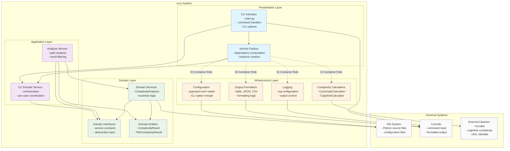

# cccy アーキテクチャ設計書

## 概要

cccyは、Pythonコードの循環的複雑度と認知的複雑度を測定するCLIツールです。本システムはClean Architectureの原則に基づいて設計されており、依存性の方向を制御し、テスタビリティと保守性を向上させています。

## アーキテクチャ図（C4モデル - コンテナーレベル）

## アーキテクチャの詳細説明

### 1. Presentation Layer（プレゼンテーション層）

**責務：** ユーザーインターフェースと外部との相互作用

- **CLI Interface**: Clickフレームワークを使用したコマンドラインインターフェース
- **Service Factory**: 依存性注入のコンポジションルート（DIコンテナの役割）

**重要なポイント：**
- ユーザー入力の検証とコマンド解析
- 依存性の組み立てと注入（ファクトリパターン）
- Clean Architectureの例外として、ファクトリでインフラストラクチャ層への依存を許可

### 2. Application Layer（アプリケーション層）

**責務：** ユースケースの実行とビジネスフローの調整

- **CLI Facade Service**: プレゼンテーション層向けのファサード
- **Analysis Service**: 複雑度解析の実行とパス管理

**重要なポイント：**
- ドメインサービスの組み合わせによるユースケース実現
- インフラストラクチャの詳細から分離された純粋なビジネスロジック
- 依存性注入により具象実装から切り離し

### 3. Domain Layer（ドメイン層）

**責務：** ビジネスルールとドメインロジックの実装

- **Domain Interfaces**: サービス契約の定義（ポート）
- **Domain Entities**: 複雑度データを表現するエンティティ
- **Domain Services**: 複雑度解析のコアロジック

**重要なポイント：**
- 外部への依存を持たない純粋なビジネスロジック
- インターフェースにより依存性の方向を制御
- 複雑度計算のドメインルールを実装

### 4. Infrastructure Layer（インフラストラクチャ層）

**責務：** 外部システムとの統合と技術的詳細の実装

- **Complexity Calculators**: 外部ライブラリを使用した計算実装
- **Configuration**: 設定ファイルの読み込みと管理
- **Output Formatters**: 多様な出力形式への変換
- **Logging**: ログ出力の制御

**重要なポイント：**
- ドメインインターフェースの具象実装（アダプター）
- 外部ライブラリやファイルシステムとの統合
- 技術的詳細の隠蔽と交換可能性の確保

## 依存性の方向と制約

### Clean Architectureの依存性ルール

1. **Domain Layer**: 外部への依存なし（独立性維持）
2. **Application Layer**: ドメイン層のみに依存
3. **Infrastructure Layer**: ドメイン層のみに依存（アプリケーション層は禁止）
4. **Presentation Layer**: アプリケーション層とドメイン層に依存

### 特別な考慮事項

- **Service Factory**: DIコンテナの役割として、インフラストラクチャ層への依存を例外的に許可
- **Interface Segregation**: ドメイン層のインターフェースにより依存性を逆転
- **Dependency Injection**: ファクトリパターンによる実行時の依存性解決

## 設計上の利点

### 1. テスタビリティ
- インターフェースによりモックやスタブが容易に作成可能
- ドメインロジックの単体テストが独立して実行可能

### 2. 保守性
- 各層の責務が明確に分離されている
- 変更の影響範囲が限定される

### 3. 拡張性
- 新しい出力形式や計算アルゴリズムの追加が容易
- インフラストラクチャの変更がビジネスロジックに影響しない

### 4. 再利用性
- ドメインサービスは異なるインターフェース（Web API等）で再利用可能
- 計算エンジンの交換や拡張が可能

## 実装における重要な設計パターン

### 1. Repository Pattern
- ファイルシステムアクセスの抽象化

### 2. Factory Pattern
- 依存性組み立ての集約化

### 3. Facade Pattern
- 複雑なサブシステムの簡素化

### 4. Adapter Pattern
- 外部ライブラリの抽象化

この設計により、cccyは保守性、テスタビリティ、拡張性を備えた堅牢なアーキテクチャを実現しています。